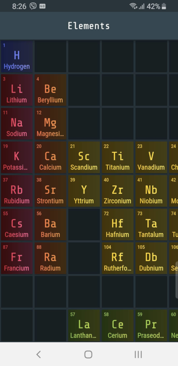
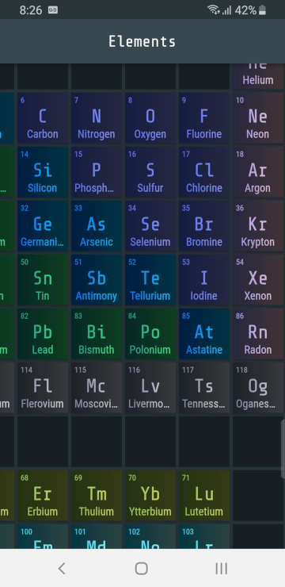
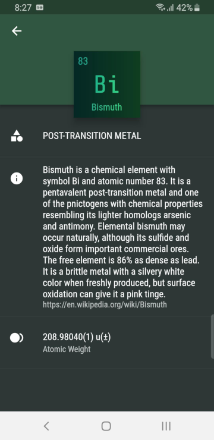
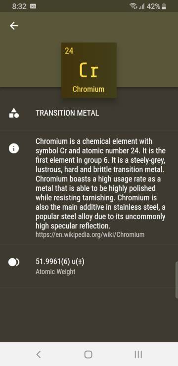

# Perioble

Perioble is a Flutter app developed to browse the chemical elements of the Periodic Table. It also includes helpful snippets of information about each element. This is a cross-platform app that runs on both Android and iOS. 

## Preview:

